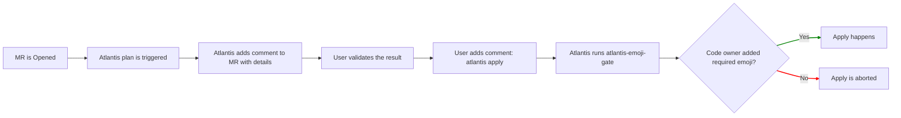

<div align="center">

# atlantis-emoji-gate


[](https://codecov.io/gh/shini4i/atlantis-emoji-gate)
[](https://goreportcard.com/report/github.com/shini4i/atlantis-emoji-gate)


</div>

> [!WARNING]
> This project is in the early stages of development. Some breaking changes may occur.

## General information

`atlantis-emoji-gate` is a tool designed to work with Atlantis on GitLab Community Edition (CE) to ensure that a
specific emoji reaction is present on a GitLab merge request.

This acts as a replacement for mandatory MR approval (which does not work on CE), and can be used to ensure that a
specific person has reviewed the MR before `atlantis apply` is allowed to run.



## Configuration

`atlantis-emoji-gate` is configured using environment variables. The following variables are available:

| Variable          | Description                                                                        | Default      | Optional |
|-------------------|------------------------------------------------------------------------------------|--------------|----------|
| `APPROVE_EMOJI`   | The emoji that must be present on the MR for `atlantis apply` to be allowed to run | `thumbsup`   | No       |
| `CODEOWNERS_PATH` | The path to the CODEOWNERS file in the repository                                  | `CODEOWNERS` | No       |
| `CODEOWNERS_REPO` | The repository to check for CODEOWNERS file                                        |              | Yes      |
| `INSECURE`        | If MR author is allowed to approve their own MR                                    | `false`      | No       |

The remaining environment variables are set dynamically by Atlantis and should not be set manually.

At this early stage, only owners of the whole repository are supported.

### Permissions

CODEOWNERS file example:

```
* @username1
/terraform @username4
/terraform/provision @username2
/terraform/deploy @username3
```

Where:
- `@username1` would be able to approve any MR
- `@username2` would be able to approve MRs that change files in the `/terraform/provision` directory
- `@username3` would be able to approve MRs that change files in the `/terraform/deploy` directory
- `@username4` would be able to approve MRs that change files in both `/terraform/provision` and `/terraform/deploy` directories

Given that we have the following repository structure:
```
.
├── CODEOWNERS
├── other_file.txt
└── terraform
    ├── deploy
    │   └── main.tf
    └── provision
        └── main.tf
```

### Workflow example

```yaml
workflows:
  default:
    plan:
      steps:
        - init
        - plan
    apply:
      steps:
        - run: atlantis-emoji-gate
        - apply
```

## Contributing

Pull requests are welcome. For major changes, please open an issue first to discuss what you would like to change.
