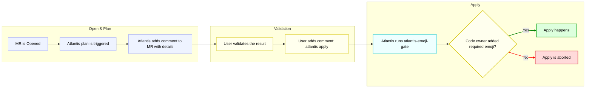

<div align="center">

# atlantis-emoji-gate

[](https://github.com/shini4i/atlantis-emoji-gate/actions/workflows/run-tests.yml)
[](https://codecov.io/gh/shini4i/atlantis-emoji-gate)
[](https://github.com/shini4i/atlantis-emoji-gate/releases/latest)
[](https://go.dev/)
[](LICENSE)
[](https://github.com/shini4i/atlantis-emoji-gate/commits/main)


A tool that implements mandatory approvals for Atlantis workflows in GitLab Community Edition (CE) using emoji reactions as an approval mechanism.

</div>

## The Problem
GitLab CE doesn't support mandatory merge request approvals, which limits Atlantis workflow capabilities. While this feature is available in Premium/Ultimate editions, CE users need an alternative solution.

## The Solution
This tool integrates with Atlantis and GitLab CE to:
- Use emoji reactions as a lightweight approval mechanism
- Enforce mandatory reviews (from codeowners) before Terraform changes can be applied
- Maintain security controls without requiring Premium features

## How it works


```mermaid
graph LR

    subgraph "Open & Plan"
        A[MR is Opened] --> B[Atlantis plan is triggered]
        B --> C[Atlantis adds comment to MR with details]
    end

    subgraph "Validation"
        C --> D[User validates the result]
        D --> E[User adds comment: atlantis apply]
    end

    subgraph "Apply"
        E --> F[Atlantis runs atlantis-emoji-gate]
        F --> G{Code owner added required emoji?}
        G -->|Yes| H[Apply happens]
        G -->|No| I[Apply is aborted]
    end

%% Style the nodes
    style A fill:#EEF3FF,stroke:#8892FF,stroke-width:1px,color:#000
    style B fill:#EEF3FF,stroke:#8892FF,stroke-width:1px,color:#000
    style C fill:#EEF3FF,stroke:#8892FF,stroke-width:1px,color:#000
    style D fill:#FFFFEE,stroke:#D4C200,stroke-width:1px,color:#000
    style E fill:#FFFFEE,stroke:#D4C200,stroke-width:1px,color:#000
    style F fill:#EEFFFF,stroke:#00C2D4,stroke-width:1px,color:#000
    style G fill:#FFFFEE,stroke:#D4C200,stroke-width:2px,color:#000
    style H fill:#DDFFDD,stroke:#09A009,stroke-width:2px,color:#000
    style I fill:#FFDADA,stroke:#CC0000,stroke-width:2px,color:#000

%% Style specific links (6 and 7 from the original diagram)
    linkStyle 6 stroke:green,stroke-width:2px
    linkStyle 7 stroke:red,stroke-width:2px

```

## Where to get?

Pre-built Docker images are available - you don't need to build your own custom Atlantis image. You can use the  image from this [GitHub Container Registry](https://github.com/shini4i/docker-atlantis/pkgs/container/atlantis).

```
docker pull ghcr.io/shini4i/atlantis:v0.32.0
```

## Configuration

`atlantis-emoji-gate` is configured using environment variables. All of the following are optional:

| Variable          | Description                                                                              | Default      |
|-------------------|------------------------------------------------------------------------------------------|--------------|
| `APPROVE_EMOJI`   | The emoji that must be present on the MR for `atlantis apply` to be allowed to run       | `thumbsup`   |
| `CODEOWNERS_PATH` | The path to the CODEOWNERS file in the repository                                        | `CODEOWNERS` |
| `CODEOWNERS_REPO` | A separate `group/project` to read the CODEOWNERS file from instead of the MR's project  |              |
| `INSECURE`        | If MR author is allowed to approve their own MR                                          | `false`      |
| `RESTRICTED`      | Only count approvals given after the latest push to the MR                               | `false`      |

The remaining environment variables are set dynamically by Atlantis and should not be set manually.

The GitLab endpoint must answer directly: the client does not follow redirects, so a proxy that
redirects (http to https, host rewrite) makes every request fail with the 3xx status.

### Permissions

Given that we have the following repository structure:
```
.
├── CODEOWNERS
├── other_file.txt
└── terraform
    ├── deploy
    │   └── main.tf
    └── provision
        └── main.tf
```

CODEOWNERS file example:

```
* @username1
/terraform/* @username4
/terraform/provision @username2 @username4
```

Rules are evaluated top to bottom against the Atlantis project directory (`REPO_REL_DIR`, e.g. `terraform/deploy`) and **the last matching rule wins**. With the file above:
- `@username2` and `@username4` can approve MRs in `terraform/provision`
- `@username4` can approve MRs in `terraform/deploy` (and in any other direct subdirectory of `terraform`)
- `@username1` can approve MRs in any directory that no later rule matches; `*` is a fallback, not a superuser

Patterns use Go's [`filepath.Match`](https://pkg.go.dev/path/filepath#Match) syntax. A leading `/` is ignored. `*` on its own matches every directory, but inside a pattern it does not cross `/`: `terraform/*` matches `terraform/deploy` and not `terraform/deploy/prod`. A bare path such as `terraform` matches only that exact directory, not the ones below it.

### Workflow example

```yaml
workflows:
  default:
    plan:
      steps:
        - init
        - plan
    apply:
      steps:
        - run: atlantis-emoji-gate
        - apply
```

## Contributing

Pull requests are welcome. For major changes, please open an issue first to discuss what you would like to change.

### Development

This project uses a [Nix flake](flake.nix) for the development environment and [Task](https://taskfile.dev) for automation:

```sh
nix develop     # enter a shell with Go and all required tooling
task --list     # list available tasks
task test       # generate mocks and run the test suite
```
